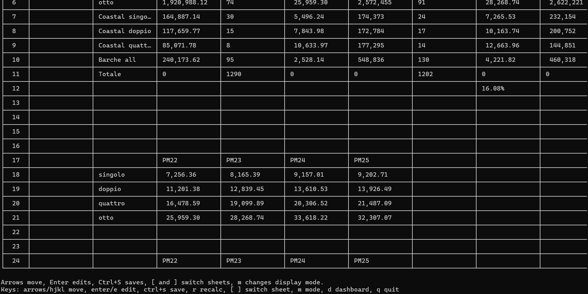
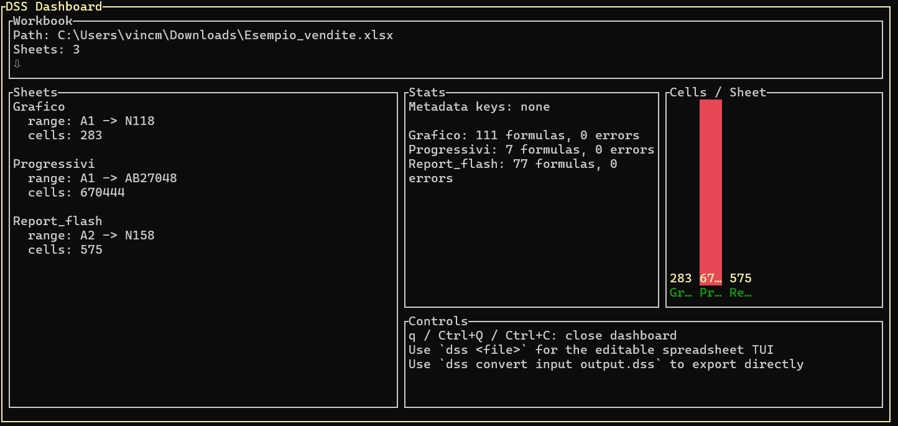

# DSS

`dss-go` is a Go command-line tool for loading [DSS](https://github.com/Datastripes/DataSheetStandard), CSV, XLS, XLSX, and XLSM workbooks, computing formulas, editing them in a full-screen terminal spreadsheet view with bordered cells, visualizing workbook summaries in a termdash dashboard, and exporting back to DSS.

## Current Commands

```text
dss <input> [--output output.dss]
dss tui <input> [--output output.dss]
dss dashboard <input>
dss convert <input> <output.dss>
dss set <input> <output.dss> --sheet NAME --cell A1 --value VALUE
```

Passing a workbook path directly opens the interactive TUI.

The UI shows a bordered spreadsheet grid, a compact formula/value bar for the selected cell, color-coded formula/error states, and live editing directly in the selected cell.



## Controls

- Move with arrow keys or `h`, `j`, `k`, `l`
- Start editing immediately by typing
- Edit the current cell without replacing it with `Enter`
- While editing, the current text is shown live in the selected cell and in the top info bar
- Move inside the edit buffer with arrow keys, `Home`, `End`, `Ctrl+A`, and `Ctrl+E`
- Clear edit content with `Ctrl+U`
- Save DSS with `Ctrl+S`
- Recalculate with `r`
- Switch sheets with `Tab` and `Shift+Tab`
- Cycle display mode with `m`
- Open the dashboard for the current file with `d`
- Quit with `q`
- Advanced sheet aliases remain available with `[` and `]`

## Dashboard

- `dss dashboard <input>` opens a workbook summary dashboard built with `termdash`
- The dashboard shows workbook totals, sheet ranges, formula/error counts, and quick usage hints
- Press `Enter` or `e` to jump back into the editable spreadsheet view
- Close it with `q`, `Ctrl+Q`, or `Ctrl+C`



## Current Formula Support

- Arithmetic: `+`, `-`, `*`, `/`, parentheses
- Comparisons: `=`, `<>`, `<`, `<=`, `>`, `>=`
- Cell references: `A1`
- Ranges: `A1:B10`
- Boolean literals: `TRUE`, `FALSE`
- Functions: `SUM`, `AVG`, `AVERAGE`, `MIN`, `MAX`, `COUNT`, `COUNTA`, `IF`, `ABS`, `ROUND`, `POWER`, `MOD`, `SQRT`, `AND`, `OR`, `NOT`, `LEN`, `CONCAT`, `CONCATENATE`
- Imported XLSX/XLSM formulas with unsupported functions fall back to the cached workbook value when one is available.

I'm still working on adding more functions and improving error handling, but the current set covers many common use cases.

## Format Notes

- `.xlsx` and `.xlsm` are imported with `excelize`.
- `.xls` is imported with `extrame/xls` and currently loads cell values only.
- `.xlsm` macros are ignored.
- DSS export writes sparse multi-anchor blocks instead of flattening each sheet into one padded rectangle.

## Example

```text
go run ./cmd/dss ../sample.xlsx
go run ./cmd/dss tui ../sample.xlsx --output ../sample.dss
go run ./cmd/dss dashboard ../sample.xlsx
go run ./cmd/dss convert ../sample.xlsx ../sample.dss
go run ./cmd/dss set ../sample.dss ../edited.dss --sheet Sheet1 --cell C3 --value "=SUM(A1:B2)"
```
